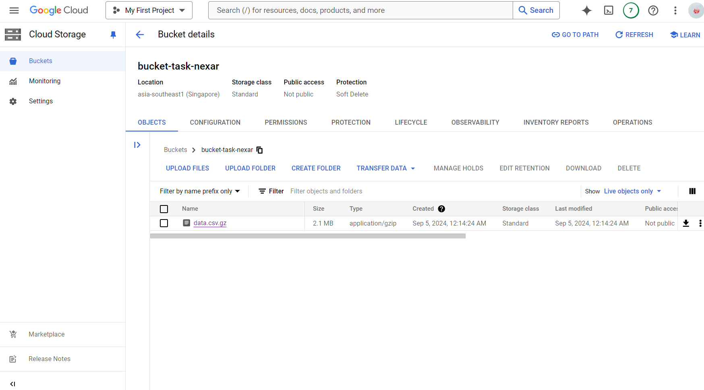
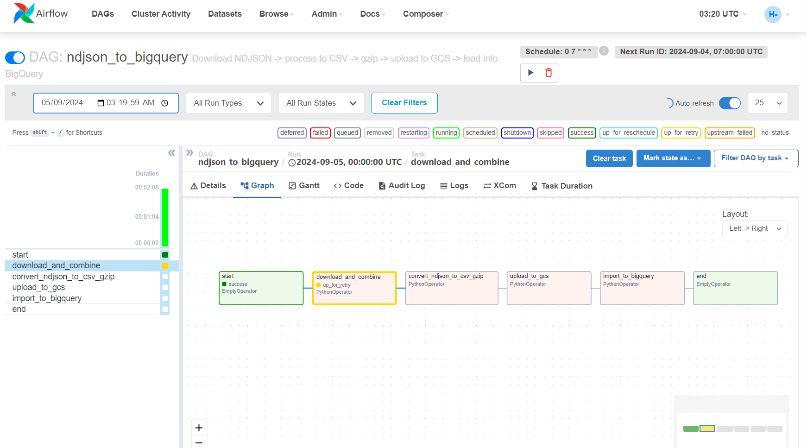

# Tổng Quan Pipeline

Dự án này bao gồm việc thiết lập một pipeline dữ liệu với các nhiệm vụ sau:

### Công Nghệ Sử Dụng:
- **Cloud Composer**: Công cụ điều phối để quản lý pipeline.
- **Google Cloud Storage (GCS)**: Dịch vụ lưu trữ cho các tệp CSV đã nén.
- **BigQuery**: Kho dữ liệu để nhập và truy vấn dữ liệu.

### Xác định các nhiệm vụ:
*Xem các thư viện trong file etl.py*

1. **Tải Dữ Liệu NDJSON**:  
   - Tải dữ liệu dưới dạng NDJSON từ một nguồn bên thứ ba. 
   - *Lưu ý*: Đối với bài kiểm tra, dữ liệu demo được cung cấp từ url:https://raw.githubusercontent.com/AA583/ndjson_download/main/data.ndjson.  
   - **Yêu cầu**: Sử dụng đa luồng (multi-threading) để thực hiện quá trình tải dữ liệu.
   - **Ý tưởng**: 
      1. Xác định dung lượng file phân tách trong quá trình tải thông qua kích thước file ndjson gốc và số lượng thread lựa chọn
      2. Sử dụng ThreadPoolExecutor thực hiện quá trình tải các file phân tách
      3. Sau khi tải xong, kết hợp các file phân tách thành một file ndjson.
      ```py
      def download_and_combine(url, num_threads):
         with requests.get(url, stream=True) as response:
            if response.status_code != 200:
                  raise Exception(f"Failed to download file: {response.status_code}")

            site = urllib.request.urlopen(url)
            meta = site.info()
            total_size = int(meta["Content-Length"])

            chunk_size = total_size // num_threads if total_size else 1024 * 1024 

            combined_data = BytesIO()

            with ThreadPoolExecutor(max_workers=num_threads) as executor:
                  futures = []
                  for chunk_num, chunk in enumerate(response.iter_content(chunk_size), start=1):
                     futures.append(executor.submit(combined_data.write, chunk))

                  for future in futures:
                     future.result()
                     
            combined_data.seek(0)
            return combined_data.getvalue()
      ```

2. **Chuyển Đổi Dữ Liệu Sang CSV**:  
   - Chuyển đổi dữ liệu NDJSON đã tải thành định dạng CSV. 
   - Nén tệp CSV bằng gzip.
   ```py
   def convert_ndjson_to_csv_gzip(data_bytes):
      # Chuyển đổi dữ liệu byte thành DataFrame
      df = pd.read_json(BytesIO(data_bytes), lines=True)

      # Chuyển DataFrame thành CSV trong bộ nhớ
      csv_buffer = BytesIO()
      df.to_csv(csv_buffer, index=False)
      csv_data = csv_buffer.getvalue()

      # Nén dữ liệu CSV bằng gzip và lưu vào BytesIO
      gzip_buffer = BytesIO()
      with gzip.GzipFile(fileobj=gzip_buffer, mode='wb') as f_out:
         f_out.write(csv_data)
      
      # Trả về dữ liệu nén dưới dạng bytes
      return gzip_buffer.getvalue()
   ```

3. **Upload Lên Google Cloud Storage (GCS)**:  
   - Trước khi upload, tạo một bucket trong GCS để lưu trữ tệp đã nén.
   

   - Upload tệp CSV đã nén lên bucket GCS.
   ```py
   def upload_to_gcs(bucket_name, data_bytes, destination_blob_name):
      # Khởi tạo client GCS
      client = storage.Client()
      bucket = client.bucket(bucket_name)
      blob = bucket.blob(destination_blob_name)

      data_buffer = BytesIO(data_bytes)
      data_content = data_buffer.getvalue()
      # Tải lên tệp Gzip
      blob.upload_from_string(data_content, content_type='application/gzip')
   ```

   - Kết quả: 
   

4. **Nhập Dữ Liệu Vào BigQuery**:
   - Tạo một bảng trong BigQuery.
   

   - Import dữ liệu từ bucket GCS vào bảng BigQuery.
   ```py
   def import_to_bigquery(bucket_name, destination_blob_name, dataset_name, table_name):
      bigquery_client = bigquery.Client()
      uri = f"gs://{bucket_name}/{destination_blob_name}"

      # Cấu hình công việc tải lên
      job_config = bigquery.LoadJobConfig(
      source_format=bigquery.SourceFormat.CSV,
      skip_leading_rows=1,  # Bỏ qua dòng tiêu đề nếu có
      autodetect=True,  # Tự động phát hiện schema
      )

      # Tải lên BigQuery
      job = bigquery_client.load_table_from_uri(
      uri,
      f'{dataset_name}.{table_name}',
      location='asia-southeast1',  # Thay thế bằng vùng của bạn
      job_config=job_config
      )
   ```

   - Kết quả:
   

## Hướng dẫn:

1. **Clone repository**:
```console
   git clone https://github.com/AA583/Nexar-de-test.git      
```
2. **Tạo Cloud Composer**:
   - Trước khi tạo Cloud Composer, cần tạo Service accounts:
   

   - Add các role cần thiết cho composer:
   

   - Tạo Composer Cloud:
   

3. **Set job scheduler**
   - Truy cập Airflow thông qua màn hình Cloud Composer bên trên:
   

   - Upload file pipeline_dag.py lên folder dag trong bucket được tạo trong quá trình tạo composer:
   

   - Sau khi upload file pipeline_dag.py thì xuất hiện job:
   

4. **DAG Pipeline**
   

*Câu 5 của em chưa hoàn thành được toàn bộ yêu cầu. Hệ thống gặp lỗi trong việc quản lý flow. Trước khi deploy, code đã được test trên local, vì vậy có kết quả upload trên GCS và table trong BigQuery ở trên*
